# LUCAS

LUCAS was the project I worked on for much of my first co-op at Nth Cycle, a metal refining startup. As the sole software engineer, the design, code, and associated infrastructure was wholly authored by me. This software is neither a completed product nor professional grade. This product is a result of attempting to solve problems rather than implement features, so the scope and design of the application was very fluid. Coupled with time constraints, I had to prioritize working code over most other concerns, such as testing or code organization.

I have consent of the company to have screenshots of LUCAS posted publicly and to give live demos to employers under the condition that none of the company's processes or data are revealed. To be sure to avoid any impropriety, I have opted to completely change the theme of the process to emulate how a fictional bread manufacturer might use the application.

The color scheme is made to match the company colors. The name LUCAS is in accordance with the "Stranger Things" company naming scheme, with a backronym of "Lab Uploads Centralized And Searchable."

Here are some screenshots of the application:

Homepage:
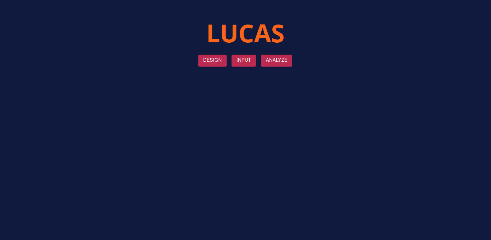
Design tab:
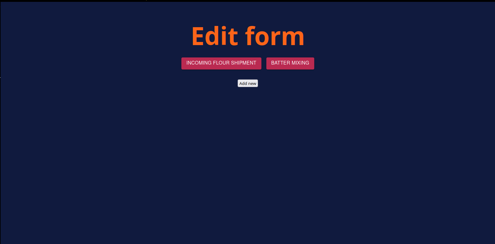
A simple form design. You drag blocks from the toolbox on the left into the workspace. Hovering over blocks shows a tooltip.
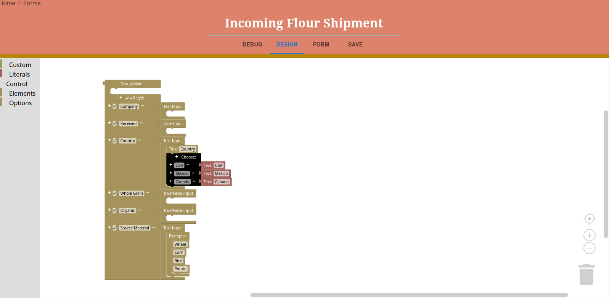
Here's the interactive preview of the form generated by those blocks
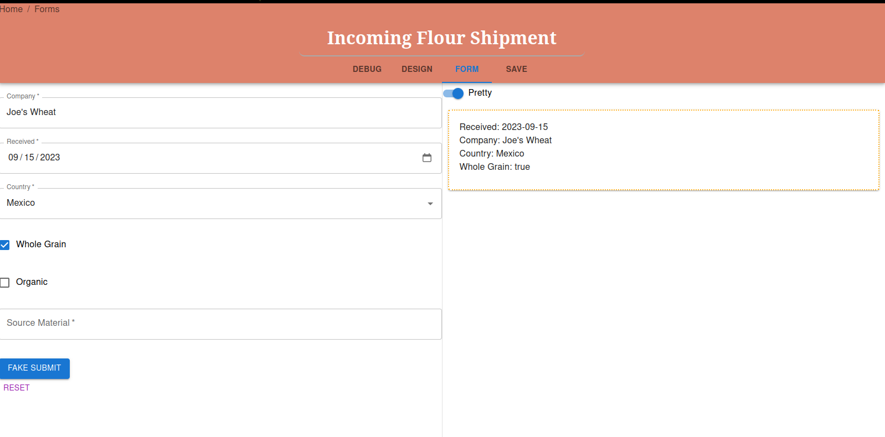
This is the save panel. The "File input to bind to" will create a file upload button on the form and process the data according to a javascript function to yield the data to be uploaded to the database. If there is also a corresponding form, then the data from the form will be appended to each of the document(s) generated by the file. This is useful if you have special mixers which report digital data in a csv!
Here is a more complicated form which conditionally renders fields:

Here's what it looks like submitting the form for real:
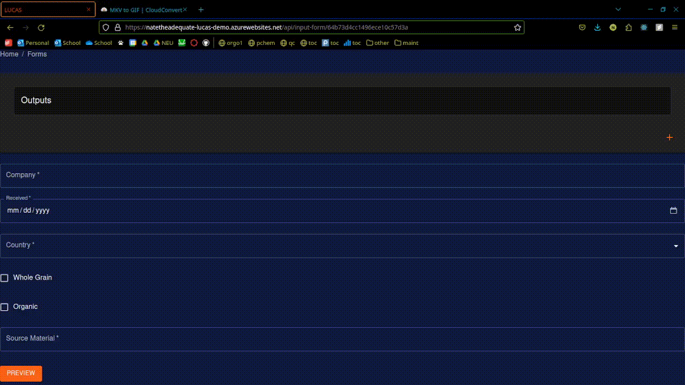
Once you submit, it takes you to analytics dashboards. I have inputted a batch of fake data in order to demonstrate features of this. Here are some examples of aggregation pipelines and the results they have.
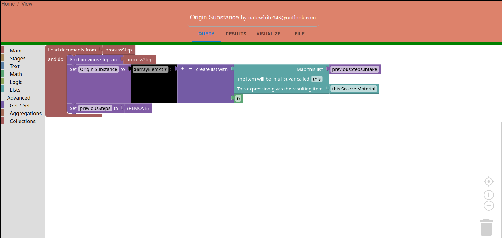
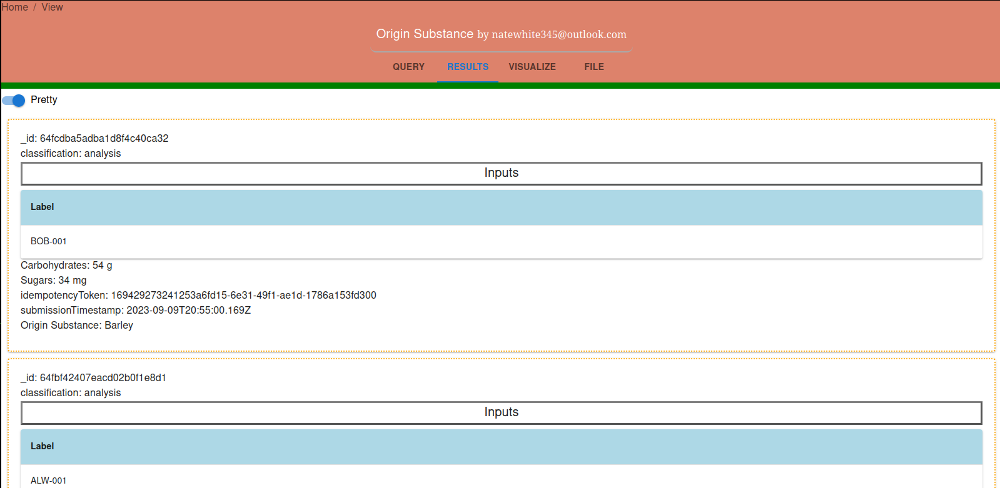
Example using the dimensional analysis feature
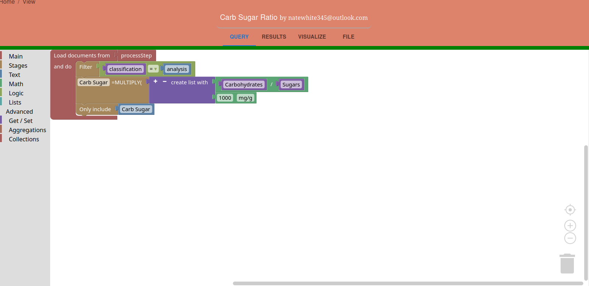
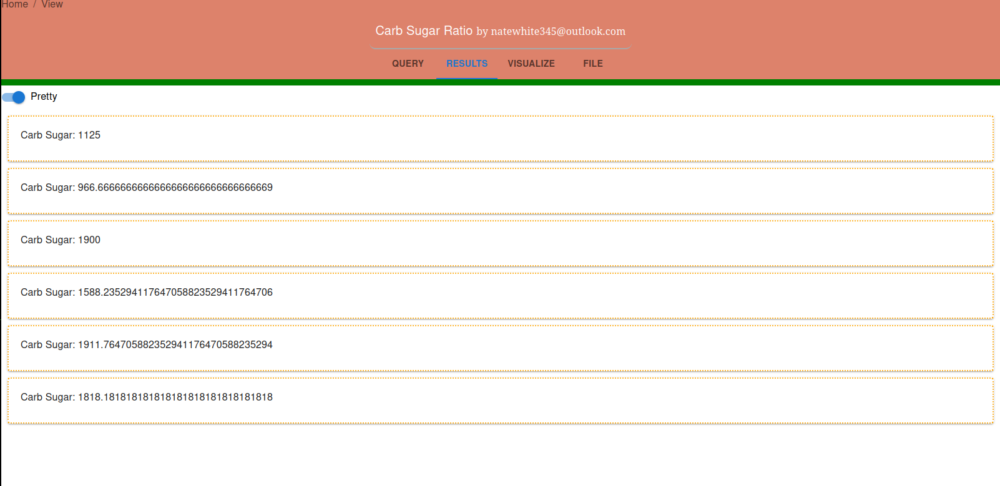
Doing lookups, referencing other pipelines
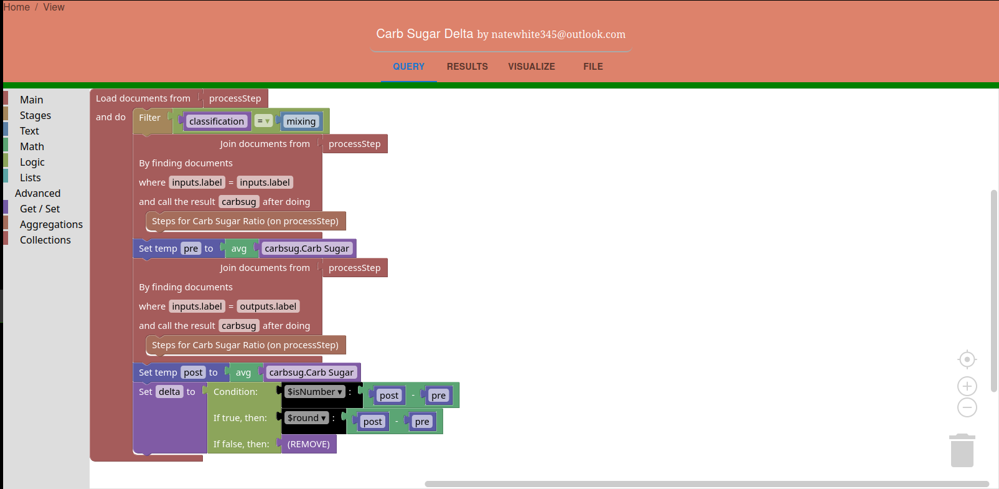
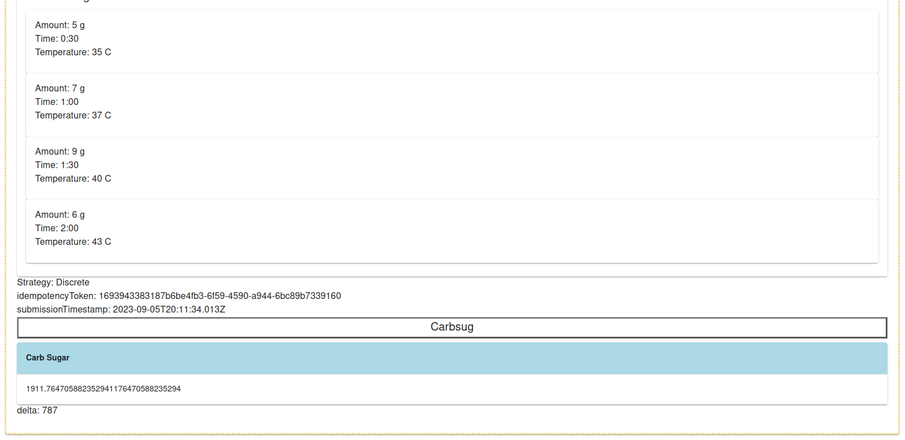
Here's an example end result using all the pipelines.
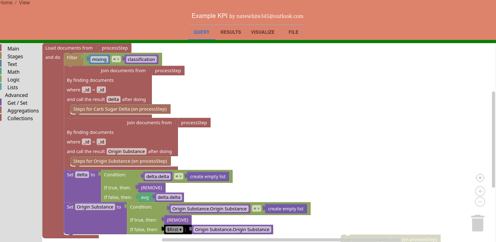
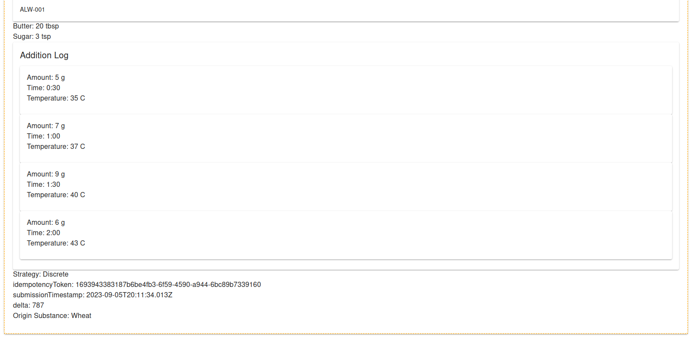
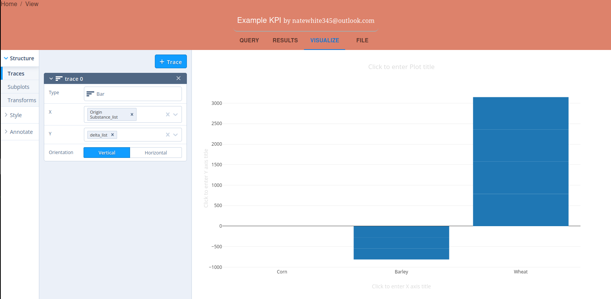